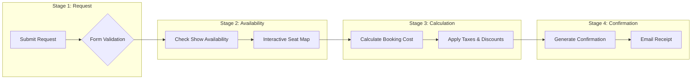

# Movie Ticket Booking Management Application
### 🎥 Pega National Internship Program - Capstone Project
### ?? **[Live Demo on GitHub Pages](https://rdsourav05.github.io/Pega_internship/)**

Welcome to the **Movie Ticket Booking Management Application** repository. This project is built as part of **Pega's National Internship Program** to demonstrate core capabilities in Low-Code Application Development, Case Lifecycle Management, Data Modeling, and User Portal design using Pega Infinity.

---

## 📌 Project Overview
The **Movie Ticket Booking Management Application** automates the process of reserving movie tickets, managing theater seating arrangements, calculating dynamic ticket pricing, and generating digital booking confirmations. It replaces manual processes with a streamlined digital experience for customers and system managers.

---

## 🏗️ System Architecture & Case Lifecycle

The case type lifecycle is structured into four main stages, guiding a booking from initiation to final receipt.

### 1. Request Stage (US-001)
*   **Submit Movie Ticket Request:** The customer initiates the booking case by filling in booking preferences:
    *   *Movie Selection:* Select from a list of currently running films.
    *   *Date & Showtime:* Select the preferred date and show slot.
    *   *Theater & Location:* Choose the cinema hall.
    *   *Ticket Category:* Select between Standard or Premium seating.
    *   *Ticket Quantity:* Specify the number of seats needed.

### 2. Availability Stage (US-002)
*   **Check Show Availability:** The system query checks real-time seat inventory.
    *   *Seat Map Display:* A custom visual seating grid (Layout Group / Repeating Dynamic Layout) displays occupied vs. available seats.
    *   *Seat Selection:* The user selects their specific seat numbers matching their requested ticket quantity.

### 3. Calculation Stage (US-003)
*   **Calculate Booking Cost:** Pega Data Transforms and Decision Tables run to compute pricing:
    *   *Base Price Calculation:* E.g., Standard = $150 / ticket, Premium = $300 / ticket.
    *   *Taxes:* Applying 18% Service Tax/GST.
    *   *Discounts:* Applying bulk discount rules (e.g., 10% off for 5+ tickets).
    *   *Total Price:* Computes the final payable amount.

### 4. Confirmation Stage
*   **Generate Confirmation:** Resolves the case with status `Resolved-Completed`.
    *   *Transaction ID:* Generates a unique reference ID.
    *   *Email Notification:* Sends a summary confirmation to the customer's email.

---

## 💾 Data Modeling & Schema Design

Below are the primary Pega Data Classes configured for this application:

| Data Class | Properties | Description |
| :--- | :--- | :--- |
| `Pega-Data-Movie` | `MovieID`, `Title`, `Genre`, `Duration`, `Language`, `Rating` | Details of all active movies. |
| `Pega-Data-Theater` | `TheaterID`, `Name`, `Location`, `TotalSeats`, `SeatingLayout` | Cinema hall configurations. |
| `Pega-Data-ShowTime` | `ShowTimeID`, `MovieID`, `TheaterID`, `DateTime`, `AvailableSeats` | Specific show schedules. |
| `Pega-Data-Booking` | `BookingID`, `CustomerName`, `Email`, `ShowTimeID`, `SeatNumbers`, `TotalPrice`, `Status` | Transactions and booking records. |

---

## 👥 User Personas & Portals

1.  **Customer Portal:**
    *   Clean, mobile-responsive portal designed to request tickets.
    *   View order history and booking status.
2.  **Manager/Admin Portal:**
    *   Dashboard highlighting booking trends, revenue, and theater occupancy rates.
    *   Form interfaces to add new movies, configure showtimes, and block/release seating.

---

## 📸 Project Completion Screenshots

> [!IMPORTANT]
> The screenshots below verify the completion of the project user stories within the Pega Platform.

### 1. Case Lifecycle Design
*Placeholder for Case Lifecycle screenshot (showing Request, Availability, Calculation, and Confirmation stages).*

### 2. Submit Request UI (US-001)
*Placeholder for ticket selection form view showing movie, date, and ticket quantity inputs.*

### 3. Seat Selection Grid (US-002)
*Placeholder for the interactive seat selection layout showing available and selected seats.*

### 4. Cost Calculation Rule (US-003)
*Placeholder for the Pega Data Transform or Decision Table rule calculating final prices with tax.*

### 5. Final Confirmation Screen
*Placeholder for the booking confirmation view showing the summary, transaction ID, and resolved status.*

---

## 🚀 How to Run the Web Prototype Locally
For presentation and review, a fully working HTML/CSS/JS prototype simulating this Pega app is included in this repository:
1.  Double-click `index.html` in your file explorer to open it in any browser.
2.  Follow the step-by-step Pega flow wizard to book a ticket, interact with the seat map, and view the price breakdown.
